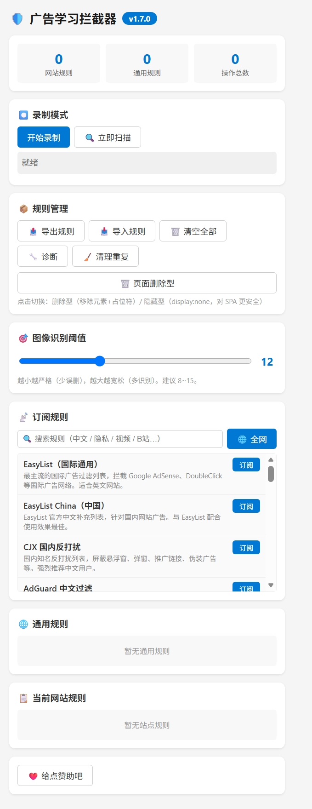
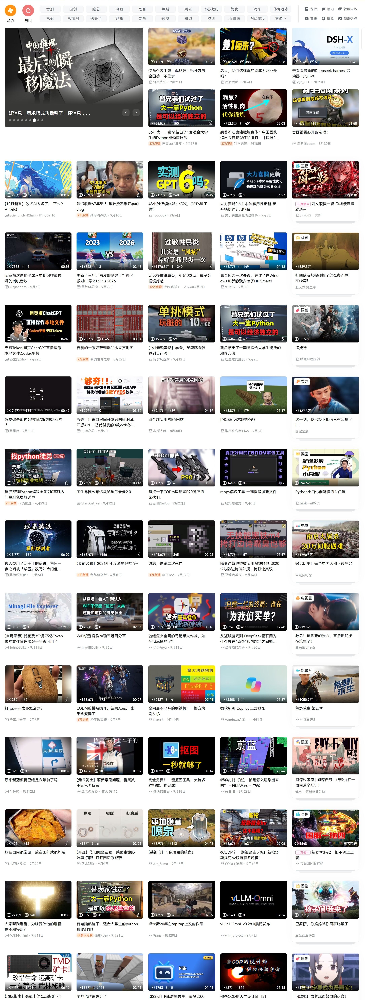

# 广告学习拦截器（Ad Blocker for Edge）

一个基于**学习**的浏览器广告拦截扩展（Manifest V3），支持录制操作自动关闭/删除广告、订阅 Adblock Plus 规则、图像角标识别、规则去重等。适用于 Microsoft Edge / Chrome。

---

## ✨ 功能特性

### 1. 录制模式（学习型拦截）
- **录制点击 / 标记删除**：在页面上手动操作，扩展记录你的动作，生成"通用规则"或"站点规则"
- **同 class 批量删除**：同一 class 删除 2 次后，自动批量清理页面所有同类元素（可回放）
- **撤回**：支持撤回最后一次操作（点击 / 删除）
- **采集角标**：学习该站点的广告角标特征（class / 图像指纹）

### 2. 订阅规则（Adblock Plus 兼容）
- 内置 EasyList / EasyList China 等多种规则源
- **FilterLists 全网搜索**：支持中文关键词搜索（自动翻译 + 同义词），分页懒加载
- 解析 ABP 语法：`||` 网络规则、`##` 元素隐藏、`@@` 例外、`$options` 映射
- 规则自动去重、智能选取（超出 DNR 上限时按评分取舍）

### 3. 图像识别（dHash）
- 内置"广告/推广"角标模板（base64 内嵌，启动时自动计算指纹）
- 支持**按域名学习**角标特征，采集后仅在该站生效
- 汉明距离阈值可调（popup 滑块，默认 10）

### 4. 拦截模式切换
- **🗑️ 删除型**：移除元素 + 占位符（点击可恢复）
- **👁️ 隐藏型**：仅 `display:none`（不碰 DOM，对 SPA 更安全）
- 一键切换，自动转换已处理元素，持久化保存

### 5. 其它
- 元素隐藏（CSS `display:none`，安全可恢复）
- 删除备份与占位符恢复（内存节点优先，保留事件/iframe/视频状态）
- 诊断工具、规则导出 / 导入、重复清理
- IndexedDB 存储，性能优化（扫描预算、dHash 缓存、懒加载队列）

---

## 📦 安装方法

### 方式一：加载已解压的扩展（推荐）

1. **下载源码**
   - 点击本仓库右上角 `Code` → `Download ZIP`，解压到任意文件夹
   - 或使用 git：
     ```bash
     git clone https://github.com/a13543431108/Ad-blocker---Edge-extension.git
     ```

2. **打开扩展管理页**
   - Edge 浏览器地址栏输入：`edge://extensions/`
   - 或 Chrome：`chrome://extensions/`

3. **开启开发者模式**
   - 打开页面右上角的 **「开发人员模式」** 开关

4. **加载扩展**
   - 点击 **「加载解压缩的扩展」**（Edge）/ **「加载已解压的扩展程序」**（Chrome）
   - 选择包含 `manifest.json` 的**文件夹**（即解压后的项目根目录）

5. **完成**
   - 工具栏出现扩展图标即安装成功

### 方式二：打包分发
将项目文件打包为 zip（不含外层文件夹），分发给用户解压加载。

> ⚠️ 注意：本项目未上架官方商店，需手动加载。

---

## 🎬 安装后的效果

### 扩展界面


### 效果 1：自动拦截常见广告
安装并启用后，访问包含广告的网站（如 B站、爱奇艺等），扩展会：
- 自动识别并**删除**带有广告特征的元素（`.ad-container`、`.sponsored` 等）
- 命中订阅规则时，**网络请求级拦截**（DNR，先于页面渲染）
- 带有"广告 / 推广"角标的卡片自动清理

**表现**：页面广告消失，原位置可能出现灰色占位符（「点击显示被隐藏的内容」）。

**拦截前（以 B站 为例，广告/推广卡片可见）：**


**拦截后（页面删除型，广告被移除并留占位符）：**


**拦截后（页面隐藏型，广告 `display:none`）：**



### 效果 2：录制学习，定制拦截
对于通用规则覆盖不到的网站（尤其**内源广告**）：
1. 点击扩展 → **「开始录制」**
2. 页面上点 **「✖ 标记删除」** → 点击要删除的广告
3. 同类广告删 2 次后，自动批量清理
4. 点 **「⏹ 停止」** → 选择保存为「通用规则」或「站点规则」
5. **刷新页面** → 扩展自动回放规则，广告被清除

### 效果 3：拦截模式切换
- **删除型**：广告彻底移除，留占位符（可点击恢复）
- **隐藏型**：广告 `display:none`，DOM 保留（适合 B站等 SPA，避免破坏页面）

在 popup → **「📦 规则管理」** → 点「🗑️ 页面删除型 / 👁️ 页面隐藏型」切换。

### 效果 4：规则订阅
1. 点击扩展图标 → **「📡 订阅规则」**
2. 输入关键词（如"中文"、"隐私"、"B站"）→ 点 **「🌐 全网」**
3. 从 FilterLists 搜索结果中选择订阅
4. 规则自动解析、去重、安装

### 效果 5：图像角标识别
1. 录制模式下点 **「📷 采集角标」**
2. 点击页面上的广告角标图片
3. 扩展学习该角标的 class / 图像指纹（按域名保存）
4. 此后该站的同类角标自动识别

---

## ⚙️ 使用说明

### Popup 面板
| 区域 | 功能 |
|------|------|
| ⏺️ 录制模式 | 开始录制、立即扫描 |
| 📦 规则管理 | 导出/导入/清空规则、诊断、清理重复、**拦截模式切换** |
| 🎯 图像识别阈值 | dHash 汉明距离（越小越严格，建议 8~15）|
| 📡 订阅规则 | 内置订阅 + FilterLists 全网搜索 |
| 🌐 通用规则 | 已保存的通用规则列表 |
| 📋 当前网站规则 | 当前站点的专属规则 |

### 录制指示器（页面上）
| 按钮 | 功能 |
|------|------|
| ↩️ 撤回 | 撤回最后一次操作 |
| ⏹ 停止 | 停止录制并保存 |
| ✖ 标记删除 | 点击要删除的广告（单次操作，删一个后自动退出）|
| 📷 采集角标 | 采集广告角标特征 |

---

## 🔧 技术说明

- **Manifest V3**（`declarativeNetRequest` 网络拦截 + `content_scripts` 页面脚本）
- **DNR 动态规则**：分块安装（每块 500 条），失败退化为逐条，自动跳过非法规则
- **dHash 图像指纹**：9×8 缩放，64 位指纹，支持反色比对
- **IndexedDB**：全局规则 / 站点规则存储
- **性能**：扫描预算（单阶段超时中断）、URL 缓存、图片判定队列、组合选择器

---

## 📄 文件结构

```
├── manifest.json      # 扩展清单
├── background.js      # 后台服务（规则解析、DNR、存储）
├── content.js         # 页面脚本（录制、扫描、删除/隐藏）
├── popup.html         # 弹窗界面
├── popup.js           # 弹窗逻辑
├── icon.png           # 扩展图标
└── shm.png            # 收款码（赞助）
```

---

## ⚠️ 已知限制

1. **内源广告**（网站自营广告）无统一特征，无法通用识别，需**按站点采集/录制**
2. **跨域图片**（如 B站 `hdslb.com`）无 CORS，dHash 读不了像素，只能靠 class 匹配
3. **SPA 站点**（B站/YouTube）删除 DOM 可能破坏框架，建议用**隐藏型**或延迟删除
4. 部分需特殊 action 的规则（`$csp`、`$redirect`、`$removeparam`）被跳过

---

## 📜 许可

仅供学习研究使用。

---

## ❤️ 赞助

如果这个扩展帮到你，欢迎请作者喝杯咖啡（见 popup 底部收款码）。
